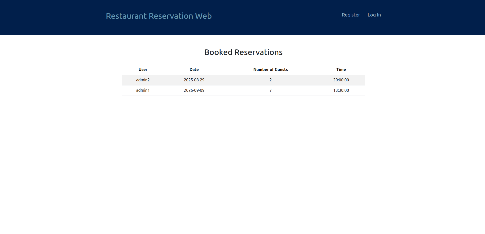
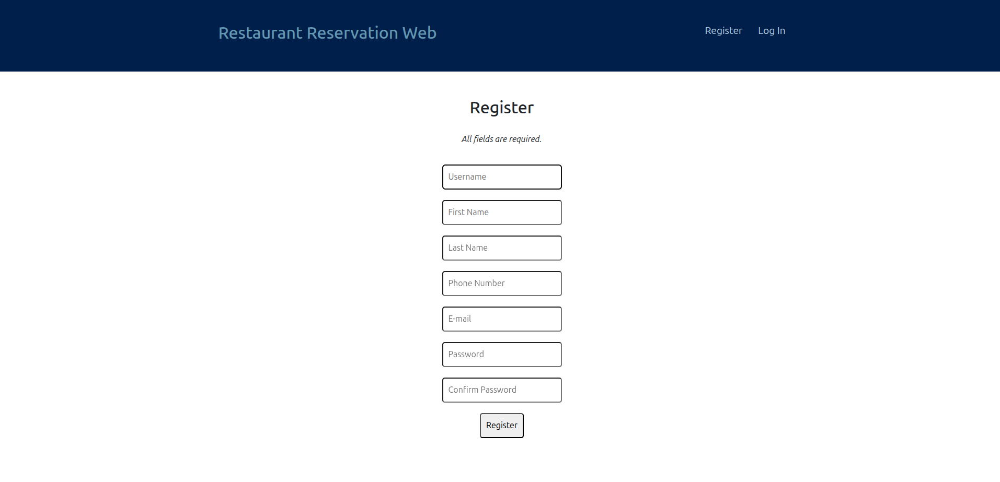
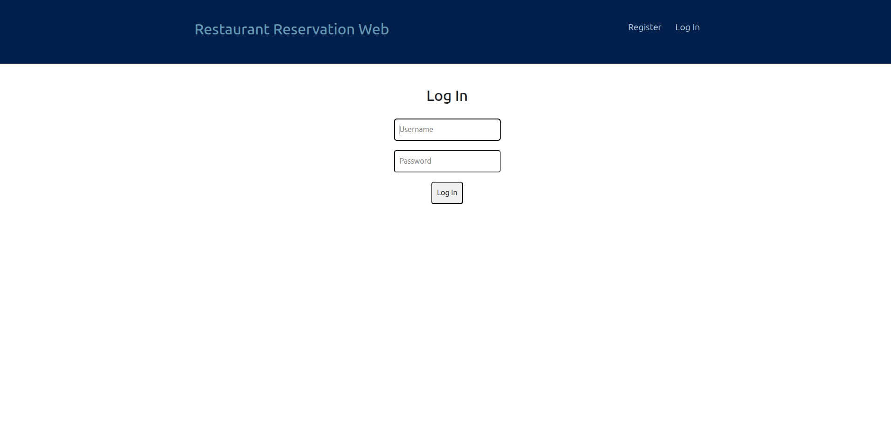
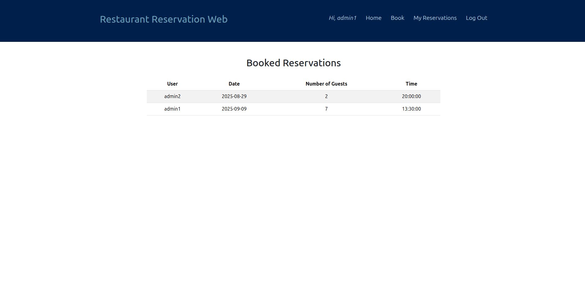
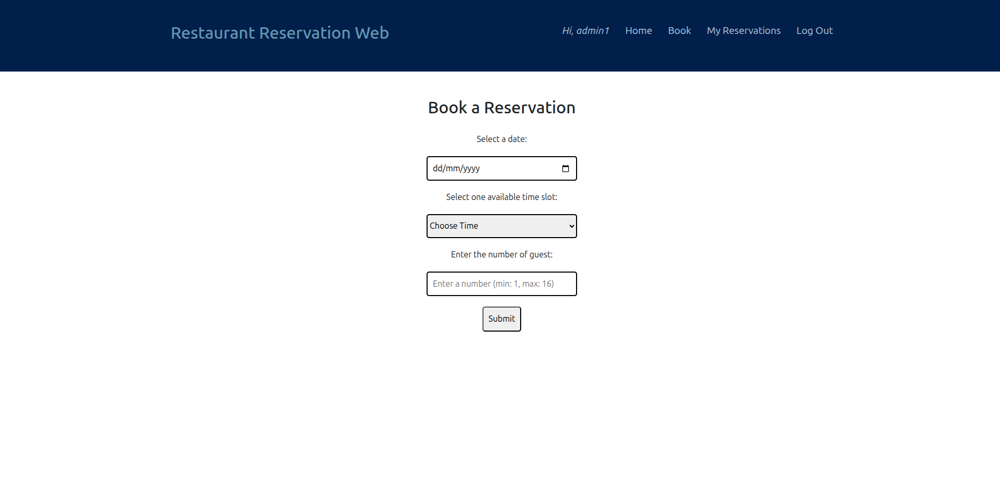
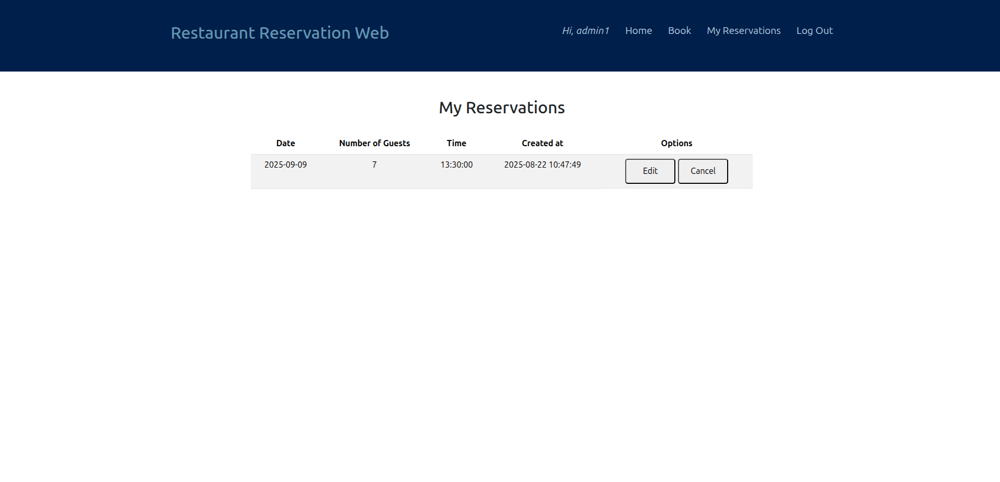
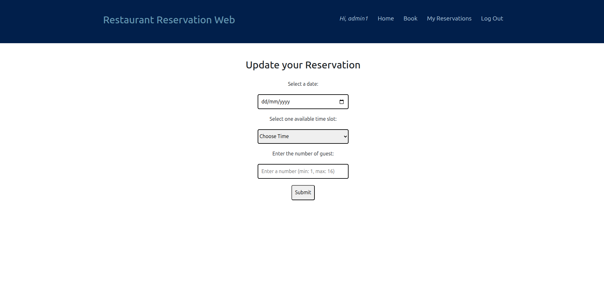
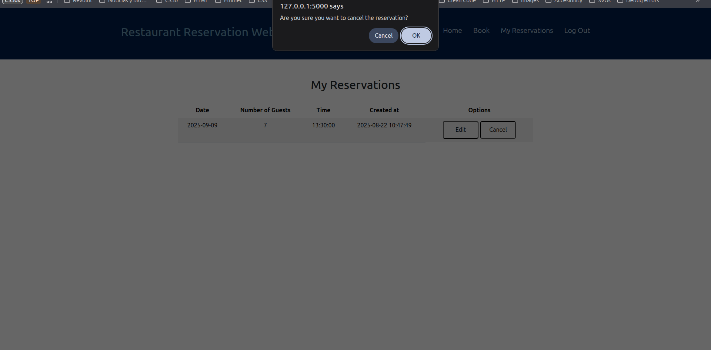
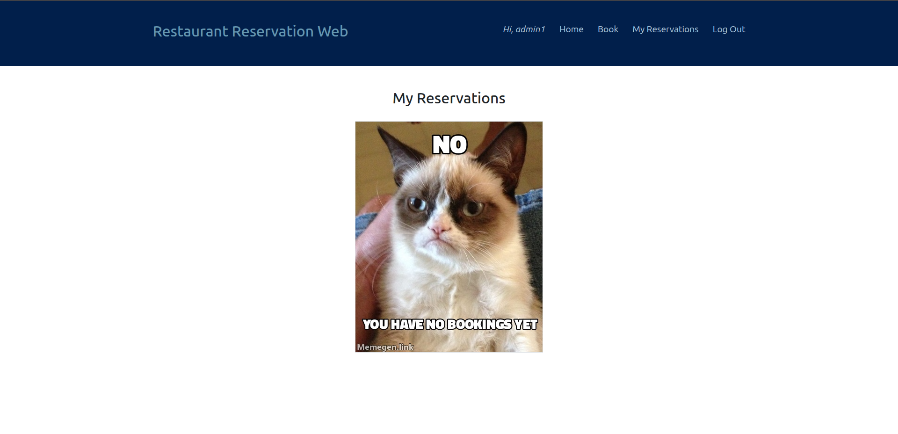

# Restaurant Reservation Web App
A full-stack web application to manage restaurant reservations,
developed as a final project for Harvard's CS50x course.


## Table of Contents
- [Demo Video](#demo-video)
- [Project Overview](#project-overview)
- [Tech Stack](#tech-stack)
- [Features](#features)
- [Installation](#installation)
- [Database Schema](#database-schema)
- [Usage](#usage)
- [Deployment](#deployment)
- [References](#references)
- [License](#license)


## Demo Video
[Watch the demo](#)


## Project Overview
This application allows restaurants to efficiently manage reservations
online. Users can register, log in, book, modify, or cancel
reservations, and view current bookings via a clean and intuitive
interface.


## Tech Stack
- **Frontend:**
    - HTML
    - CSS
    - JavaScript
    - Bootstrap
- **Backend:**
    - Python/Flask
    - Jinja
- **Database:**
    - SQLite


## Features
- User registration and authentication.
- Book, update, or cancel reservations.
- View all and personal reservations.
- User dashboard for managing reservation data.
- Deployable as a standalone package or on production servers.


## Installation
### Prerequisites
The following instructions assume a bash-like CLI and Python 3.12.3.

### 1. Create and activate a virtual environment
Create the project directory and the virtual environment:
```bash
$ mkdir restaurant-reservation-web
$ cd restaurant-reservation-web
$ python3 -m venv .venv
```
Activate the virtual environment:
```bash
$ . .venv/bin/activate
```

### 2. Clone the repository
Clone via SSH:
```bash
$ git clone git@github.com:DaniLoBerr/restaurant-reservation-web.git
```
or via HTTP:
```bash
$ git clone https://github.com/DaniLoBerr/restaurant-reservation-web.git
```

### 3. Install dependencies
```bash
$ pip install -e .
```
The `-e` flag installs the package in *editable mode*, useful for
development.

### 4. Initialize the database
```bash
$ flask --app restaurant --init-db
```
The SQLite database will be created in the `instance/` directory.


## Database Schema
The project uses a relational SQLite database to manage users,
restaurant tables, reservation slots, and reservations. The schema
is designed to support multiple users, fixed table assignments, and
flexible time slots. Below is a summary of the structure:

### Tables Overview
|Table|Description|
|-----|-----------|
|users|Stores registered users and administrator accounts|
|tables|Represents individual restaurant tables available for booking|
|time_slots|Defines available time periods for reservations|
|reservations|Records reservation data including date, user, and status|
|reservation_tables|Maps reservations to the specific tables assigned|

### Initial Data
The database initializes with one admin user, four tables (each with
4 seats), and four available time slots (two at lunch, two at dinner).

All passwords are securely **hashed**.

For further details, see the SQL schema in `schema.sql` in the
repository.


## Usage
### Start the Development Server
```bash
flask --app restaurant run --debug
```
The `--debug` flag enables detailed error reporting and live reloading.

The app will be available at: http://127.0.0.1:5000/

### App Navigation
**Index page**

Displays all active restaurant reservations:



**Register a new user**



**Log in**


**Logged-in homepage**


**Book a new reservation**


**See your reservations**


**Edit a reservation**


**Cancel a reservation**


**No reservations**



## Deployment
You can deploy this app with a production-ready settings as follows:

### 1. Build a wheel file
```bash
$ pip install build
$ python3 -m build --wheel
```
This wheel file will be found in dist/restaurant-1.0.0-py3-none-any.whl.
The format is
{project name}-{version}-{python tag} -{abi tag}-{platform tag}.

### 2. Transfer and install the wheel file on server
Copy the the wheel file on another machine,
[create a virtual environment](#1-create-and-activate-a-virtual-environment)
and install it:
```bash
$ pip install restaurant-*.whl
```
After installation, [initialize the database](#4-initialize-the-database).
By default, the SQLite database will be located in
`.venv/var/restaurant-instance`.

### 3. Configure the Secret Key
By default, in development mode, the secret key is "dev".
For production, generate a secure key:
```bash
echo "SECRET_KEY = \"$(python -c 'import secrets; print(secrets.token_hex())')\"" > \
.venv/var/restaurant-instance/config.py 
```

### 4. Run with a production server
Install a production-ready WSGI server such as **waitress**:
```bash
$ pip install waitress
```

Run the application factory:
```bash
$ waitress-serve --call 'restaurant:create_app'
```
The app will be available at: http://0.0.0.0:8080

**Note**: *For larger deployments or if handling sensitive data,
consider serving using more robust WSGI servers*.


## References
- [Flask Documentation](https://flask.palletsprojects.com/en/stable/)
- [Bootstrap Documentation](https://getbootstrap.com/)
- [CS50x Guidelines](https://cs50.harvard.edu/x/)

## License
This project is licensed under the
[MIT License](https://choosealicense.com/licenses/mit/).
